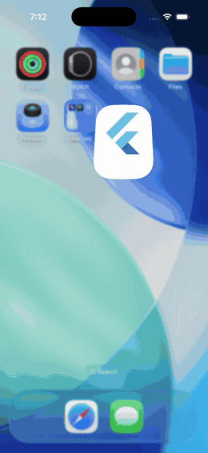
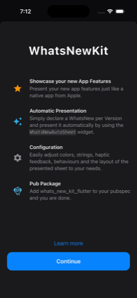
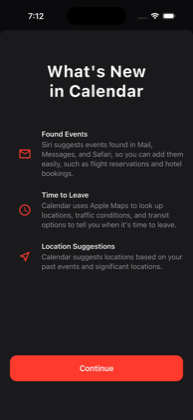
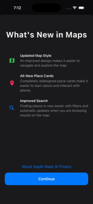
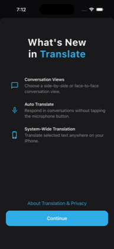
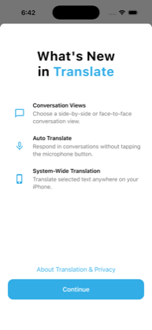
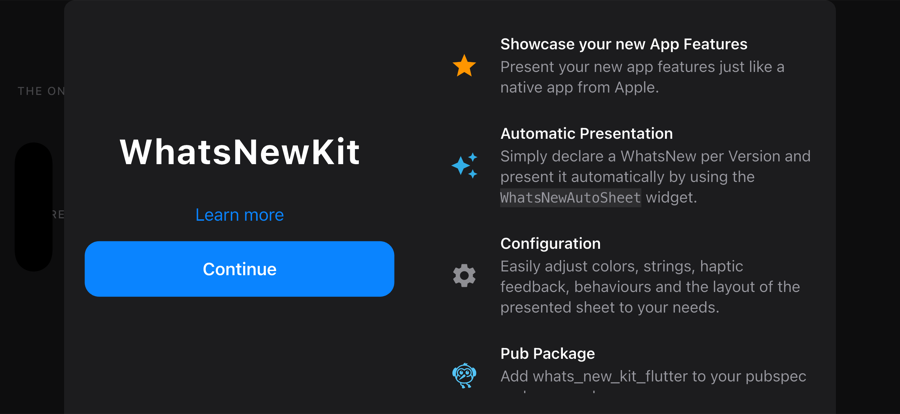
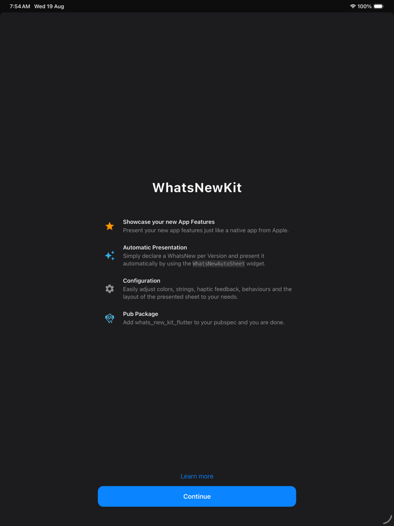
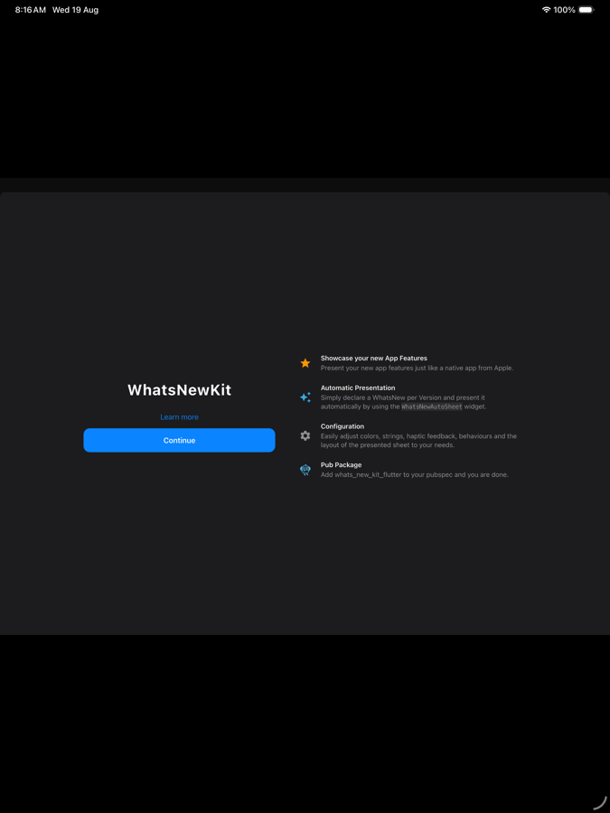

# whats_new_kit_flutter

[](https://pub.dev/packages/whats_new_kit_flutter)
[](LICENSE)
[](https://pub.dev/packages/whats_new_kit_flutter)
[](https://pub.dev/packages/whats_new_kit_flutter/score)

The polished **"What's New in this version"** screen that Apple shows after an
update — for Flutter. A faithful port of
[SvenTiigi/WhatsNewKit](https://github.com/SvenTiigi/WhatsNewKit), with a
Flutter-shaped API and every colour taken from your app's own theme.

<p align="center">
  
</p>

---

## What is this, in plain terms?

When you ship an update, most users never find out what changed. The usual fix
is a one-time screen listing the highlights — a title, a few rows of icon +
headline + explanation, and a button to get on with it.

This package gives you that screen, and handles the fiddly part for you:

- **Showing it exactly once.** Not once per launch, not never — once per release,
  per user, and it survives restarts.
- **Knowing when to show it.** You declare what changed in each version; it works
  out which one the current user should see, if any.
- **Looking right everywhere.** Light and dark, phone and tablet, portrait and
  landscape, iOS and Android and desktop.

It has **no required plugin dependencies**, works on all six Flutter platforms,
and compiles to WebAssembly.

If you have used the "What's New" screen in Apple's Calendar, Maps or Translate
apps, this is that screen.

<p align="center">
  
  
  
  
</p>

---

## Quick start

**1. Add the dependency**

```bash
flutter pub add whats_new_kit_flutter
```

**2. Show a sheet**

```dart
import 'package:flutter/material.dart';
import 'package:whats_new_kit_flutter/whats_new_kit_flutter.dart';

ElevatedButton(
  onPressed: () => showWhatsNewSheet(
    context,
    version: '1.0.0',
    title: "What's New",
    features: <WhatsNewFeature>[
      WhatsNewFeature(
        icon: Icons.history,
        title: 'Time Machine',
        subtitle: 'Travel back in time.',
      ),
      WhatsNewFeature(
        icon: Icons.bolt,
        title: 'Faster Everything',
        subtitle: 'Twice the speed, half the battery.',
      ),
    ],
    onContinue: () {},
  ),
  child: const Text('Show me'),
);
```

That is the whole API for the common case. Colours come from
`Theme.of(context)`, so it already matches your app. The returned `Future`
completes when the sheet is dismissed.

> **New to Flutter?** `context` is the variable Flutter hands you inside a
> `build` method or a callback. If you are inside `build`, just pass `context`.

---

## Contents

| Section | Read this if you want to… |
| --- | --- |
| [Show it once per release](#show-it-once-per-release) | stop repeating yourself on every launch |
| [Telling it your app version](#telling-it-your-app-version) | wire up where the version comes from |
| [How it decides](#how-it-decides-what-to-show) | understand the rules before trusting them |
| [Theming](#theming) | change colours and fonts |
| [Responsive layout](#responsive-layout) | phones, tablets, landscape, split view |
| [Layout](#layout) | change spacing, size and shape |
| [Rich text](#rich-text) | bold a word, add a link, colour part of the title |
| [Actions](#actions) | add a second button, a link, or haptics |
| [Presentation](#presentation) | control sheet vs dialog vs full page |
| [Storage](#storage) | change or replace where "already seen" is recorded |
| [Testing](#testing-your-integration) | write tests around it |
| [Migrating from WhatsNewKit](#migrating-from-whatsnewkit) | you are coming from the Swift package |
| [FAQ](#faq) | something is not behaving |

---

## Show it once per release

The manual call above shows the sheet every time you call it. For the usual
"show each release's notes once", declare your history and let the package
decide.

```dart
final WhatsNewController controller = WhatsNewController(
  versionStore: SharedPreferencesWhatsNewVersionStore(),
  collection: <WhatsNew>[
    WhatsNew.of(
      version: '1.0.0',
      title: 'Welcome',
      features: <WhatsNewFeature>[
        WhatsNewFeature(
          icon: Icons.waving_hand_outlined,
          title: 'Hello',
          subtitle: 'Thanks for installing.',
        ),
      ],
    ),
    WhatsNew.of(
      version: '1.1.0',
      title: "What's New in 1.1",
      features: <WhatsNewFeature>[
        WhatsNewFeature(
          icon: Icons.speed,
          title: 'Faster',
          subtitle: 'Startup is twice as quick.',
        ),
      ],
    ),
  ],
);

MaterialApp(
  home: WhatsNewScope(
    controller: controller,
    child: const WhatsNewAutoSheet(child: HomePage()),
  ),
);
```

On launch, `WhatsNewAutoSheet` reads the running app version, compares it
against what the user has already seen, and presents the right sheet — or
nothing at all. Dispose the controller when you are done with it, the same as
any `ChangeNotifier`.

### Telling it your app version

Reading the version is a policy decision — marketing version, build number, or
a value from remote config — so this package does not take a plugin dependency
to guess for you. Choose one:

```dart
// A. Read it from the bundle. Add package_info_plus to your own pubspec.
Future<void> main() async {
  WidgetsFlutterBinding.ensureInitialized();
  WhatsNewAppVersion.resolver =
      () async => (await PackageInfo.fromPlatform()).version;
  runApp(const MyApp());
}

// B. Set it directly, if you already know it.
WhatsNewAppVersion.overrideCurrent(const WhatsNewVersion(1, 2, 0));

// C. Pass it per call, and never configure anything.
showWhatsNewSheet(context, version: '1.2.0', /* … */);
WhatsNewController(currentVersion: const WhatsNewVersion(1, 2, 0), /* … */);
```

Forget to do any of these and you get a `StateError` naming all three options,
rather than a silently wrong `0.0.0`.

> **Where does `WhatsNewAutoSheet` go?** It presents through the nearest
> `Navigator`, so it must sit *below* one. Wrapping `home` is the simplest spot.
> `MaterialApp.builder` runs *above* the navigator it builds, so if you prefer
> that spot, give `MaterialApp` a `navigatorKey` and pass the same key to
> `WhatsNewAutoSheet(navigatorKey: …)`.

### How it decides what to show

Ported from WhatsNewKit exactly:

1. If the running version has already been shown → show nothing.
2. Otherwise show the entry whose version matches it exactly.
3. Failing that, fall back to the `major.minor.0` entry — so declaring `1.2.0`
   also covers users on `1.2.7` — unless that entry has already been shown.

Two behaviours are inherited on purpose, and are worth knowing before you ship:

- **Versions are compared for equality, never ordering.** Someone upgrading
  straight from `1.0.0` to `1.3.0` sees the `1.3.x` sheet only, not every
  release they skipped. If you want a combined "everything since your last
  version" sheet, build that entry yourself and give it the new version number.
- **Dismissing counts as seen — including a swipe-down.** Without this, anyone
  who swipes the sheet away would be shown it again on every single launch. If
  you would rather only count a deliberate tap, pass
  `markPresented: WhatsNewMarkPresented.primaryActionOnly`.

### Manual control

`WhatsNewController` is a plain `ChangeNotifier`; you do not have to use the
automatic widget.

```dart
final WhatsNew? pending = await controller.resolvePending();
if (pending != null && context.mounted) {
  await WhatsNewSheet.show(context, whatsNew: pending, versionStore: controller.versionStore);
}

await controller.markPresented(const WhatsNewVersion(1, 2, 0)); // suppress it
await controller.resetPresentedVersions();                      // replay everything
```

---

## Theming

Nothing is hardcoded. Every colour is read from the ambient `ColorScheme`:

| What you see | Where it comes from |
| --- | --- |
| Title, feature titles | `colorScheme.onSurface` |
| Feature subtitles | `colorScheme.onSurfaceVariant` |
| Feature icons, secondary link | `colorScheme.primary` |
| Primary button | `colorScheme.primary` filled, `colorScheme.onPrimary` label |
| Sheet background, footer blur | `colorScheme.surface` |

<p align="center">
  
  
</p>

**Tint one sheet:**

```dart
showWhatsNewSheet(context, accentColor: Colors.teal, /* … */);
```

**Restyle every sheet in the app** with a `ThemeExtension`:

```dart
ThemeData(
  extensions: const <ThemeExtension<dynamic>>[
    WhatsNewTheme(
      accentColor: Color(0xFF32ADE6),
      titleStyle: TextStyle(fontSize: 40, fontWeight: FontWeight.w800),
      footerBlurSigma: 30,
      pressedOpacity: 0.7,
    ),
  ],
)
```

Values resolve in this order — **explicit argument → theme extension →
`ColorScheme`** — so you can override as little or as much as you like.

Everything on `WhatsNewTheme`: `accentColor`, `titleStyle`,
`featureTitleStyle`, `featureSubtitleStyle`, `primaryButtonTextStyle`,
`secondaryButtonTextStyle`, `primaryButtonBackgroundColor`,
`primaryButtonForegroundColor`, `sheetBackgroundColor`, `footerBlurSigma`,
`footerScrimColor`, `footerScrimOpacity`, `pressedOpacity`, `markdownStyle`,
`onMarkdownLinkTap`, `layout`.

> **⚠️ Material 3 will change your seed colour.** `ColorScheme.fromSeed(seedColor:
> Colors.blue)` does *not* give you blue — it derives a tonal palette, which in
> dark mode is a pale lavender. That is Material behaving normally, not a bug in
> this package. If you want a literal accent, pin it:
>
> ```dart
> ColorScheme.fromSeed(seedColor: seed, brightness: brightness)
>     .copyWith(primary: seed, onPrimary: Colors.white)
> ```
>
> The example app does exactly this, which is why it matches Apple's screenshots.

---

## Layout

Every measurement from the original is exposed on `WhatsNewLayout`, with the
same defaults:

```dart
showWhatsNewSheet(
  context,
  // …
  layout: const WhatsNewLayout(
    contentSpacing: 35,                    // title → feature list
    featureListSpacing: 35,                // between features
    featureImageWidth: 56,                 // icon column
    footerPrimaryButtonCornerRadius: 8,
    footerBackground: WhatsNewFooterBackground.solid,
  ),
);
```

<details>
<summary><b>Every layout property and its default</b></summary>

| Property | Default | Controls |
| --- | --- | --- |
| `showsScrollBar` | `false` | scrollbar visibility |
| `scrollBottomContentInset` | `150` | empty space so content clears the footer |
| `contentSpacing` | `60` | gap between title and feature list |
| `contentPadding` | `top: 65` | padding around the content block |
| `contentHorizontalPadding` | `16` | horizontal padding of the content block |
| `featureListSpacing` | `25` | gap between features |
| `featureListPadding` | `start: 15` | padding around the feature list |
| `featureImageWidth` | `40` | width of the icon column |
| `featureImageSize` | `28` | rendered icon size |
| `featureHorizontalSpacing` | `15` | gap between icon and text |
| `featureCrossAxisAlignment` | `center` | icon alignment against the text |
| `featureVerticalSpacing` | `2` | gap between title and subtitle |
| `footerActionSpacing` | `15` | gap between the two actions |
| `footerPrimaryButtonCornerRadius` | `14` | button corner radius |
| `footerPrimaryButtonVerticalPadding` | `16` | sets the button height (≈54) |
| `footerBlurBleed` | `10` | how far the blur extends above the footer |
| `footerBackground` | `blur` | `blur`, `solid` or `none` |
| `bottomSafeAreaBehavior` | `absorb` | whether the safe area is absorbed or added |
| `breakpoints` | `WhatsNewBreakpoints()` | form-factor thresholds |
| `contentLayout` | `adaptive` | one column, two columns, or automatic |
| `maxContentWidth` | `560` | caps and centres the content column |
| `twoColumnMinWidth` | `600` | when `adaptive` may split |
| `twoColumnMaxWidth` | `1000` | caps the split row on wide screens |
| `twoColumnSpacing` | `48` | gap between the columns |
| `twoColumnTitleFlex` / `twoColumnFeaturesFlex` | `5` / `6` | column width shares |
| `constrainedHorizontalMargin` | `20` | side margin once capped |
| `centerContentWhenConstrained` | `true` | vertical centring on large surfaces |
| `sheetTopCornerRadius` | `10` | bottom sheet's top corners |
| `dialogMaxWidth` / `dialogMaxHeight` | `520` / `720` | dialog presentation size |
| `dialogInsetPadding` | `24` | dialog margin |
| `featuresPaddingResolver` | — | replaces the responsive feature padding |
| `footerPaddingResolver` | — | replaces the responsive footer padding |

</details>

---

## Responsive layout

The sheet adapts to the surface it is given, not to the device it is running
on — so it behaves correctly in a split view, a resized desktop window, or a
narrow dialog, not just on a whole screen.

### Two arrangements

**One column** — title above the features, actions pinned to the bottom. Used
on phones in portrait, narrow split views, and tall tablets.

**Two columns** — title and actions on one side, the feature list scrolling on
the other. Used when the surface is wide *and* shorter than it is tall. A
landscape phone has plenty of width and almost no height; stacking a 34pt
title, a feature list and a pinned footer would leave nothing to scroll in.

<p align="center">
  
</p>

<p align="center">
  
  
</p>

Choose explicitly if you prefer:

```dart
const WhatsNewLayout(
  contentLayout: WhatsNewContentLayout.single,     // never split
  // or .twoColumn to always split, or .adaptive (the default)
  twoColumnMinWidth: 600,                          // when adaptive may split
)
```

### Line length is capped

Left alone, a feature subtitle on a 1024pt tablet runs to a ~790pt line — far
past the point where text stops being readable. The content column is capped at
`maxContentWidth` (560 by default) and centred, and once capped it is also
centred vertically instead of clinging to the top of a tall screen.

```dart
const WhatsNewLayout(
  maxContentWidth: 560,                  // double.infinity restores WhatsNewKit
  twoColumnMaxWidth: 1000,               // the same idea for the split layout
  centerContentWhenConstrained: true,
)
```

Phones are never capped (393 < 560), so they keep WhatsNewKit's original
geometry exactly.

### Padding by form factor

Inside the cap, padding still follows the size-class branches of the original:

| Surface | Feature list | Footer |
| --- | --- | --- |
| Phone portrait | — | `20 / 20 / 80` |
| Phone landscape (height < 500) | — | `40 / 40 / 35` |
| Tablet (width ≥ 600) | `100` each side | `150 / 150 / 50` |
| Desktop (width ≥ 900) | `16` each side | `30` bottom |

Once `maxContentWidth` is capping the column those wide side insets would only
push it off-centre, so they collapse to `constrainedHorizontalMargin` while the
bottom inset is kept.

Move the thresholds, or replace the tables outright:

```dart
WhatsNewLayout(
  breakpoints: const WhatsNewBreakpoints(
    regularWidth: 700,
    compactHeight: 450,
    useShortestSide: true,   // stricter parity with Apple's size classes
  ),
  footerPaddingResolver: (WhatsNewFormFactor form) => switch (form) {
    WhatsNewFormFactor.compact => const EdgeInsets.all(12),
    _ => const EdgeInsets.all(40),
  },
)
```

### What is covered

Twelve golden files and a responsive test suite pin the behaviour at phone
portrait and landscape, tablet portrait and landscape, a narrow split view, a
desktop window, and a 220×320 window — asserting the arrangement, the capping,
and that nothing overflows at any of them.

---

## Rich text

Anywhere a title or subtitle is accepted, you can pass more than a plain string.

```dart
// Plain — what the shorthand constructors build for you
const WhatsNewText('Automatic Presentation')

// Inline Markdown: **bold**, *italic*, `code`, [links](https://example.com)
const WhatsNewText.markdown('Present it with `WhatsNewAutoSheet`, [docs](https://example.com).')

// Explicit spans, for a two-tone title
const WhatsNewText.rich(
  TextSpan(children: <InlineSpan>[
    TextSpan(text: "What's New\nin "),
    TextSpan(text: 'Translate', style: TextStyle(color: Color(0xFF32ADE6))),
  ]),
  semanticsLabel: "What's New in Translate",   // what screen readers announce
)

// Built at layout time, when styling depends on context
WhatsNewText.builder((BuildContext context, TextStyle base) => TextSpan(/* … */))
```

Use `WhatsNewFeature.rich` when you want styled text or non-icon artwork:

```dart
const WhatsNewFeature.rich(
  image: WhatsNewImage.asset('assets/sparkle.png'),
  title: WhatsNewText('Automatic Presentation'),
  subtitle: WhatsNewText.markdown('Declare a `WhatsNew` per version.'),
)
```

`WhatsNewImage` accepts `.icon`, `.asset`, or `.widget` for anything else — an
SVG, a Lottie animation, whatever you like.

Markdown links open in the browser by default. Route them elsewhere with
`WhatsNewTheme(onMarkdownLinkTap: …)`, and restyle them with
`InlineMarkdownStyle`.

---

## Actions

```dart
showWhatsNewSheet(
  context,
  // …
  continueLabel: 'Get Started',
  onContinue: () => print('acknowledged'),
  continueHaptic: const WhatsNewHaptic.notification(),
  secondaryAction: WhatsNewSecondaryAction.openUrl(
    title: 'Learn more',
    url: Uri.parse('https://example.com/changelog'),
  ),
);
```

Secondary action variants:

| Constructor | Behaviour |
| --- | --- |
| `WhatsNewSecondaryAction.openUrl` | opens a URL in the browser |
| `WhatsNewSecondaryAction.dismiss` | closes the sheet |
| `WhatsNewSecondaryAction.present` | pushes another sheet on top |
| `WhatsNewSecondaryAction(onPressed: …)` | anything else |

The callback receives a `WhatsNewActionContext` that can `dismiss()` or
`present()` — the equivalent of the `PresentationMode` binding WhatsNewKit hands
to a custom action.

```dart
WhatsNewSecondaryAction(
  title: const WhatsNewText('Skip setup'),
  onPressed: (WhatsNewActionContext action) {
    action.dismiss();
    Navigator.of(action.context).pushNamed('/settings');
  },
)
```

Haptics: `WhatsNewHaptic.impact([style])`, `.selection()`, `.notification([kind])`.

---

## Presentation

```dart
showWhatsNewSheet(context, presentation: WhatsNewPresentation.dialog, /* … */);
```

| Value | Result |
| --- | --- |
| `adaptive` *(default)* | bottom sheet on phone/tablet, dialog on wide desktop and web |
| `bottomSheet` | always a modal bottom sheet |
| `dialog` | always a centered dialog |
| `page` | pushes a full page onto the navigator |

To put the content inside a screen of your own — an onboarding flow, or a
"What's New" row in Settings — use the widget directly:

```dart
Scaffold(body: WhatsNewView(whatsNew: myWhatsNew))
```

---

## Storage

`WhatsNewVersionStore` records which versions a user has seen.

| Implementation | Use when |
| --- | --- |
| `SharedPreferencesWhatsNewVersionStore` | the normal choice; survives restarts |
| `InMemoryWhatsNewVersionStore` | tests, or a demo that replays every launch |
| `CachingWhatsNewVersionStore` | wraps another store and preloads it, so decisions can be made while building a frame |

Keys are written as `WhatsNewKit.<version>` — byte-identical to WhatsNewKit's
`UserDefaults` format, so **an app migrating from the Swift package keeps its
history with no migration code**.

Back it with anything by extending the base class:

```dart
final class FirestoreVersionStore extends WhatsNewVersionStore {
  @override
  Future<List<WhatsNewVersion>> presentedVersions() async { /* … */ }

  @override
  Future<void> save(WhatsNewVersion version) async { /* … */ }

  @override
  Future<void> remove(WhatsNewVersion version) async { /* … */ }

  @override
  Future<void> removeAll() async { /* … */ }
}
```

---

## Testing your integration

Keep the app version and the store deterministic, and nothing touches a plugin:

```dart
testWidgets('shows the 1.1 sheet on a fresh install', (WidgetTester tester) async {
  final WhatsNewController controller = WhatsNewController(
    currentVersion: const WhatsNewVersion(1, 1, 0),      // no package_info_plus
    versionStore: InMemoryWhatsNewVersionStore(),         // no shared_preferences
    collection: myReleaseNotes,
  );
  await controller.load();

  expect(controller.pendingWhatsNew?.version, const WhatsNewVersion(1, 1, 0));
});
```

`WhatsNewAppVersion.overrideCurrent(…)` does the same globally, if you would
rather set it once in `main`.

---

## Migrating from WhatsNewKit

| Swift | Dart |
| --- | --- |
| `WhatsNew(version:title:features:)` | `WhatsNew.of(version:title:features:)` |
| `WhatsNew.Feature(image:title:subtitle:)` | `WhatsNewFeature(icon:title:subtitle:)` |
| `WhatsNew.Layout` | `WhatsNewLayout` |
| `WhatsNewEnvironment` | `WhatsNewController` |
| `.environment(\.whatsNew, …)` | `WhatsNewScope` |
| `.whatsNewSheet()` | `WhatsNewAutoSheet` |
| `.sheet(whatsNew:)` | `WhatsNewSheet.show` |
| `UserDefaultsWhatsNewVersionStore` | `SharedPreferencesWhatsNewVersionStore` |
| `@WhatsNewCollectionBuilder` | a plain `List<WhatsNew>` |
| `WhatsNewViewController` | `WhatsNewView` |

<details>
<summary><b>Deliberate differences, and why</b></summary>

- **Version parsing is positional.** WhatsNewKit drops a non-numeric component
  and shifts the rest left, so `"1.x.3"` becomes `1.3.0`; here it becomes
  `1.0.3`. A `+build` or `-prerelease` suffix is stripped first, because pubspec
  versions look like `1.2.3+45`. `WhatsNewVersion.parseCompat` reproduces the
  Swift behaviour exactly if you need it.
- **`Title.foregroundColor` is gone.** The Swift view never reads it — it is dead
  code. Colour the title through `WhatsNewTheme.titleStyle` or a
  `WhatsNewText.rich` span.
- **The default layout is immutable.** WhatsNewKit's is a mutable static, which
  in Dart would break hot reload and parallel tests.
- **`PrimaryAction.onDismiss` is `onPressed`.** It only fires on the button, so
  the original name was misleading. The any-dismissal hook is the top-level
  `onDismiss` argument.
- **The button label defaults to `onPrimary`, not white**, which stays readable
  on a light accent colour.
- **The footer blur is drawn on every platform.** WhatsNewKit's is iOS-only.
- **Content is capped and can split into two columns.** WhatsNewKit only ever
  pads a full-width single column, which reads poorly on a tablet and wastes a
  landscape phone. Set `maxContentWidth: double.infinity` and
  `contentLayout: WhatsNewContentLayout.single` for the original behaviour.
- **No iCloud key-value store.** Implement `WhatsNewVersionStore` over a platform
  channel if you need cross-device sync.
- **Haptics carry no intensity**, and notification feedback maps to a medium
  impact — Flutter's `HapticFeedback` exposes nothing closer.

</details>

---

## FAQ

<details>
<summary><b>The sheet shows every time I launch the app.</b></summary>

You are almost certainly not passing a `versionStore`. Without one, nothing is
recorded and every call presents. Pass
`SharedPreferencesWhatsNewVersionStore()` to `showWhatsNewSheet`, or use a
`WhatsNewController`, which creates one for you.

Also check you are not using `InMemoryWhatsNewVersionStore` — it forgets
everything when the process exits, which is what the example app wants but
probably not what you want.
</details>

<details>
<summary><b>The sheet never shows.</b></summary>

Three usual causes:

1. **The version was already recorded.** Call
   `controller.resetPresentedVersions()` to replay it during development.
2. **No entry matches the running version.** Remember the fallback is only ever
   `major.minor.0` — an entry for `1.0.0` does not cover a user on `1.2.0`.
   Check `controller.currentVersion` and `controller.presentedVersions`.
3. **`WhatsNewAutoSheet` sits above the `Navigator`.** See the note in
   [Show it once per release](#show-it-once-per-release).
</details>

<details>
<summary><b>My accent colour comes out wrong.</b></summary>

Material 3 remaps seed colours. See the warning in [Theming](#theming).
</details>

<details>
<summary><b>What does it depend on?</b></summary>

Two first-party packages, and neither is required:

| Package | Used for | How to avoid it |
| --- | --- | --- |
| `shared_preferences` | the default persistent store | supply your own `WhatsNewVersionStore` |
| `url_launcher` | `WhatsNewSecondaryAction.openUrl` and Markdown links | use a plain `onPressed` callback, and set `WhatsNewTheme.onMarkdownLinkTap` |

There is deliberately **no** `package_info_plus` dependency — see
[Telling it your app version](#telling-it-your-app-version). That keeps the
package WASM-compatible and free of platform channels it does not need.
</details>

<details>
<summary><b>Does it work on Android / web / desktop?</b></summary>

Yes — it is pure Flutter with no platform code. The visual reference is iOS
because that is what it reproduces, but nothing is iOS-only. On a wide desktop
window the default `adaptive` presentation switches to a dialog.
</details>

<details>
<summary><b>How do I show a combined "everything you missed" sheet?</b></summary>

Build that entry yourself and give it the current version number. The package
deliberately does not merge entries, because merged copy usually needs
rewriting rather than concatenating.
</details>

---

## Example

```bash
git clone https://github.com/sudhi001/whats_new_kit_flutter
cd whats_new_kit_flutter/example
flutter run
```

The example reproduces WhatsNewKit's own sheets (WhatsNewKit, Calendar, Maps,
Translate), plus an automatic-presentation demo with a version picker and store
inspector, and a layout playground wired to every geometry constant.

## Compatibility

- Dart `^3.6.0`, Flutter `>=3.27.0`
- iOS, Android, macOS, Windows, Linux, Web — including `dart2wasm`
- Scores 160/160 on pub.dev's analysis

## Contributing

Issues and pull requests are welcome. Before opening a PR:

```bash
dart format .
flutter analyze          # must be clean
flutter test             # must be green, goldens included
```

Layout changes should keep the golden tests honest — regenerate with
`flutter test --update-goldens` and review the diff rather than accepting it
blindly.

## Credits

All credit for the original design and API to
[Sven Tiigi](https://github.com/SvenTiigi) and
[WhatsNewKit](https://github.com/SvenTiigi/WhatsNewKit).

## License

MIT — see [LICENSE](LICENSE).
